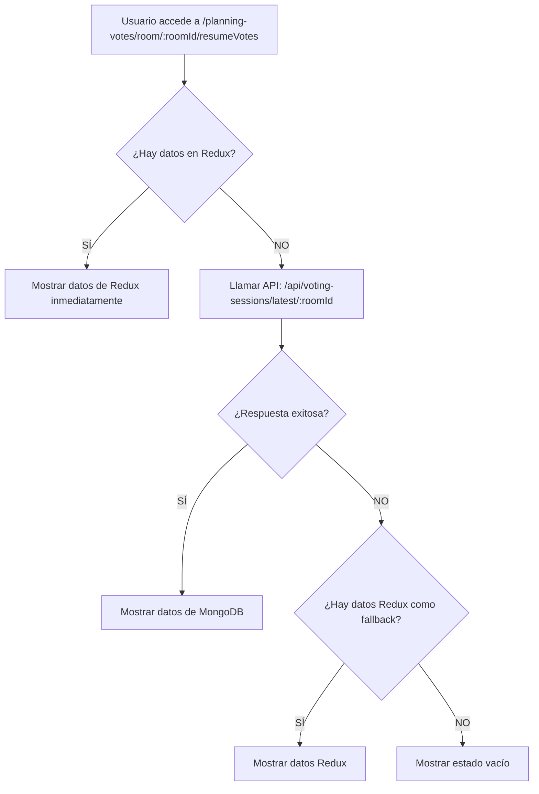

# Implementación de Persistencia con MongoDB para ResumeVotes

## 📋 Resumen del Sistema Implementado ✅

El sistema de persist### 2. **API Endpoints Implementados**

**Todas las respuestas siguen el formato estándar:**

```json
{
  "success": true,
  "data": { ...responseData }
}
```

#### GET `/api/voting-sessions/latest/:roomId`

```json
{
  "success": true,
  "data": {
    "roomId": "abc123",
    "sessionId": "session_456",
    "room": {
      /* datos completos de la sala */
    },
    "metadata": {
      /* estadísticas calculadas */
    }
  }
}
```

#### GET `/api/voting-sessions/:sessionId`

#### GET `/api/voting-sessions/room/:roomId`

### 3. **Método finishVoting Actualizado**

`````javascript
async finishVoting(io, roomId) {
  // 1. Verificar que todas las tareas están completas
  // 2. Calcular estadísticas y metadata
  // 3. Guardar en MongoDB con TTL de 5 días
  // 4. Emitir evento con sessionId para frontend

  io.to(roomId).emit('votingFinished', {
    sessionId: savedSession.sessionId,
    redirect: `/planning-votes/room/${roomId}/resumeVotes`
  });
}
````**completamente funcional** y permite acceder a los resultados de votación tanto inmediatamente después de votar como días después.

### 🚀 Funcionamiento Actual

**Una sola ruta, dos flujos automáticos:**

 - **URL**: `/planning-votes/room/:roomId/resumeVotes`

### 🔧 Configuración Técnica

1. **Proxy de Vite configurado** en `vite.config.ts`:
   ```typescript
   server: {
     proxy: {
       '/api': {
         target: 'http://localhost:3000',
         changeOrigin: true,
         secure: false,
       },
     },
   }
`````

2. **Respuesta estándar de API**:

   ```json
   {
     "success": true,
     "data": { ...sessionData }
   }
   ```

3. **Frontend maneja automáticamente** el formato de respuesta y extrae los datos.

## 🔧 Cambios Implementados en el Frontend

### 1. **Componente ResumeVotes Actualizado**

El componente ahora soporta:

### 2. **Flujo de Datos Automático**



### 3. **Configuración del Proxy**

En `vite.config.ts`:

```typescript
export default defineConfig({
  plugins: [react()],
  server: {
    proxy: {
      '/api': {
        target: 'http://localhost:3000',
        changeOrigin: true,
        secure: false,
      },
    },
  },
});
```

### 4. **Manejo de Respuestas API**

El frontend maneja automáticamente el formato estándar:

```typescript
const responseData = await response.json();
// responseData = { "success": true, "data": session }

if (!responseData.success || !responseData.data) {
  throw new Error('Formato de respuesta inválido del servidor');
}

const data: VotingSession = responseData.data; // Solo extraer los datos
setVotingSession(data);
```

## 🛠 Implementación del Backend

### 1. **Esquema de MongoDB**

```javascript
const VotingSessionSchema = new mongoose.Schema({
  roomId: String, // ID de la sala original
  sessionId: String, // ID único de la sesión
  createdAt: Date, // Timestamp de creación
  completedAt: Date, // Timestamp de finalización
  expiresAt: Date, // Expira después de 5 días
  room: {
    // Datos completos de la sala
    roomId: String,
    creatorId: String,
    app: String,
    users: Array,
    tasks: Array,
  },
  metadata: {
    // Estadísticas calculadas
    totalTasks: Number,
    totalUsers: Number,
    totalVotes: Number,
    duration: Number,
    avgConsensus: Number,
    avgEffort: Number,
  },
});
```

### 2. **Método finishVoting Actualizado**

```javascript
async finishVoting(io, roomId) {
  // 1. Verificar que todas las tareas están completas
  // 2. Calcular estadísticas y metadata
  // 3. Guardar en MongoDB con TTL de 5 días
  // 4. Emitir evento con sessionId
  // 5. Opcionalmente limpiar memoria
}
```

### 3. **API Endpoints Necesarios**

## 🚀 Pasos para Implementar

### 1. **Backend (Prioridad Alta)**

```bash
# Instalar dependencias
npm install mongoose

# Configurar conexión a MongoDB
# Implementar esquemas y modelos
# Actualizar método finishVoting
# Crear endpoints de API
```

### 3. **Integración con Socket.io**

```javascript
// En finishVoting, emitir evento de finalización
io.to(roomId).emit('voting_finished', {
  message: 'Votación finalizada y datos guardados',
  redirect: `/planning-votes/room/${roomId}/resumeVotes`,
});

// En el frontend, escuchar el evento y redirigir
socket.on('voting_finished', (data) => {
  navigate(data.redirect); // Navega a la única ruta con roomId
});
```

### 4. **Ruta Única Implementada**

```tsx
// Una sola ruta que maneja ambos flujos automáticamente
<Route
  path="/planning-votes/room/:roomId/resumeVotes"
  element={<ResumeVotes />}
/>

// El componente usa useParams() automáticamente
// No necesita props manuales
```

## 📊 Flujo de Datos Implementado

### Escenario Único: Una URL, Dos Flujos Automáticos

**URL**: `/planning-votes/room/:roomId/resumeVotes`

#### Flujo 1: Acceso Inmediato (Después de votar)

1. Usuario completa votación en tiempo real
2. `finishVoting()` guarda datos en MongoDB
3. Frontend redirige a `/planning-votes/room/:roomId/resumeVotes`
4. **Datos están en Redux** → Se muestran inmediatamente
5. **Sin llamadas API** → Experiencia rápida

#### Flujo 2: Acceso Persistente (Días después)

1. Usuario accede a `/planning-votes/room/:roomId/resumeVotes`
2. **No hay datos en Redux** → Componente detecta automáticamente
3. **Llamada automática** a `/api/voting-sessions/latest/:roomId`
4. **Carga desde MongoDB** → Datos históricos disponibles
5. **Experiencia fluida** → Mismos resultados que antes

#### Flujo 3: Fallback Inteligente

1. **API de MongoDB falla** o **no hay sesiones guardadas**
2. **Sistema verifica** si hay datos en Redux como fallback
3. **Si hay datos Redux** → Los muestra sin problemas
4. **Si no hay datos** → Muestra estado vacío elegante

## 🔒 Consideraciones de Seguridad

## 📈 Beneficios del Sistema Actual

1. **Simplicidad**: Una sola URL para ambos casos de uso
2. **Persistencia**: Datos disponibles por 5 días automáticamente
3. **Performance**: Experiencia inmediata con fallback inteligente
4. **Escalabilidad**: Reduce carga en memoria del servidor
5. **UX Mejorada**: Sin configuración manual, funciona automáticamente
6. **Auditoría**: Historial automático de todas las sesiones
7. **Robustez**: Nunca se pierden datos gracias al fallback

## 🧪 Testing

```javascript
// Casos de prueba recomendados
```

## 🎯 Resumen del Sistema Completo

### 🏗️ Arquitectura Final

### 🔄 Flujo de Datos

1. **Votación** → Redux (inmediato) + MongoDB (persistente)
2. **Acceso** → Intenta MongoDB → Fallback a Redux → UI
3. **Respuesta** → Formato estándar → Extracción de datos → Estado

### 📊 Características Clave

**✅ Estado: FRONTEND COMPLETAMENTE FUNCIONAL CON BACKEND EN PRODUCCIÓN**  
**🎯 Resultado: Sistema de persistencia completo y robusto implementado**
